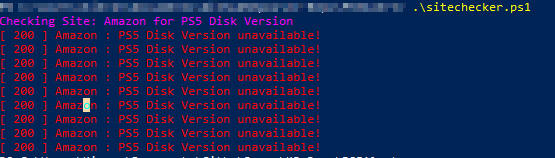

## Site Checker Script

Small script thrown together that checks the contents of the for a page. It checks for certain text on the contents of the page, if the contents are there, it will keep checking until they're no longer there.

In my example, I do;

```
CheckSite -sitename "Amazon" -link "https://www.amazon.co.uk/dp/B08H95Y452" -textocheck "Currently unavailable" -product "PS5 Disk Version" -checkintervals 120
```

This will check the PS5 product on Amazon and alert you if it can't find 'Currently Unavailable' on the page. It checks every 120 seconds. You don't want this too low, as I recently got blocked on Amazon for checking every 2 seconds!

It will send you an email for confirmation so you can step away from your desk!

The script also has a response code checker to ensure that the site you're checking is actually live.

### Expected Output



### Future Projects

- UI?
- Email Alerts (DONE)
